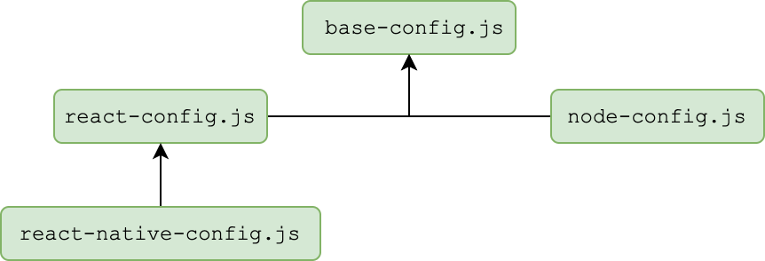

# jslint-configs

THE _best_ lint configurations for JS, React, Node and Jest!

Stop relying on humans to write consistent and good quality JavaScript.
Use [jslint-configs](https://github.com/InamTaj/jslint-configs) to ensure your code is clean from common mistakes of JavaScript/React/Node and while doing that, give your developer-productivity an unfair boost!

## ⭐️ Features

[jslint-configs](https://github.com/InamTaj/jslint-configs) support linting for the following technologies:

- JavaScript and ES6
- Node.js
- React.js (with latest [React Hooks](https://reactjs.org/docs/hooks-intro.html))

:bulb: For quickly increasing developer's knowledge it also has respective hyperlink for each lint rule as follows:

```javascript
'arrow-parens': [2,   // https://eslint.org/docs/rules/arrow-parens
  'as-needed',
],
```

## 💿 Installation

- For Yarn: `yarn add --dev jslint-configs`
- For NPM: `npm install --save-dev jslint-configs`

## 📖 About Lint Setup

The way this lint configuration is setup as follows:

- Base Configuration (Parent configuration - includes all standard JS linting rules)
- React Configuration (Inherits from Base Config - adds up all standard React.js and JSX linting rules)
- Node Configuration (Inherits from Base Config - adds up all standard Node.js linting rules)

_Let the picture speak a thousand words!_



## 🔧 Usage

- Install ESLint in your project
- Create `.eslintrc.js` at the root of your project

#### Vanilla JavaScript

If you want to lint only vanilla JavaScript, extend your project's `.eslintrc.js` file from [config-base](./config-base.js) as follows:

```javascript
module.exports = {
  extends: "./node_modules/jslint-configs/index.js"
};
```

#### React.JS Linting

If you want to lint JavaScript + React.JS code, extend your project's `.eslintrc.js` file from [config-react](./config-react.js) as follows:

```javascript
module.exports = {
  extends: "./node_modules/jslint-configs/config-react.js"
};
```

#### Node.JS Linting

If you want to lint JavaScript + Node.JS, extend your project's `.eslintrc.js` file from [config-node](./config-node.js) as follows:

```javascript
module.exports = {
  extends: "./node_modules/jslint-configs/config-node.js"
};
```

## ❤️ Contributing

Welcome contributing!

Please use GitHub's Issues/PRs.
